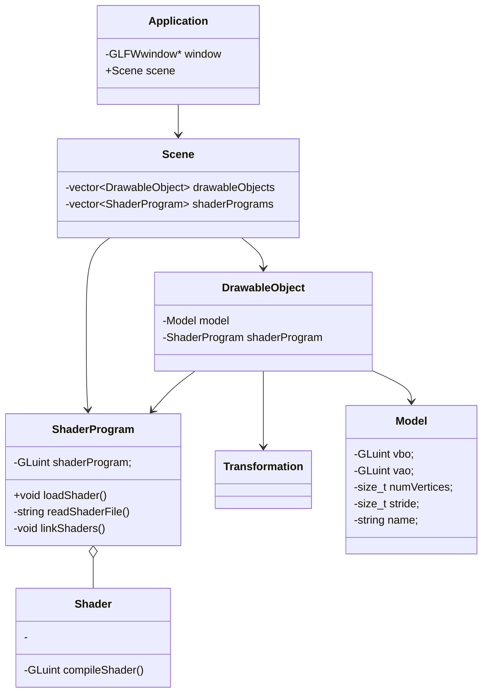

```mermaid
    classDiagram

    Application --> Scene
    Scene --> DrawableObject
    Scene --> ShaderProgram
    DrawableObject --> ShaderProgram
    DrawableObject --> Transformation
    DrawableObject --> Model
    ShaderProgram o-- Shader

    class Application{
        -GLFWwindow* window
        +Scene scene
    }

    class Scene{
        -vector~DrawableObject~ drawableObjects
        -vector~ShaderProgram~ shaderPrograms
    }

    class DrawableObject{
        -Model model
        -ShaderProgram shaderProgram 
    }

    class ShaderProgram{
        -GLuint shaderProgram;

        +void loadShader()
        -string readShaderFile()
        -void linkShaders()
    }

    class Shader{
        -GLuint compileShader()
        -
    }

    class Transformation{

    }

    class Model{
        -GLuint vbo;
        -GLuint vao;
        -size_t numVertices;
        -size_t stride;
        -string name;
    }
```
